# 🏠 Homelab Notes

# SOC Lab Implementation & Threat Analysis Portfolio

## Phase 1: Environment Setup & Baseline

### 1.1 Network Configuration & Connectivity
To establish a functional monitoring environment, the first step involved setting up the virtual infrastructure and ensuring seamless communication between all endpoints and the security platform. 

Network connectivity was verified across all virtual machines (VMs) in the lab environment to ensure victim endpoints can send logs and the attacker framework can reach targets.

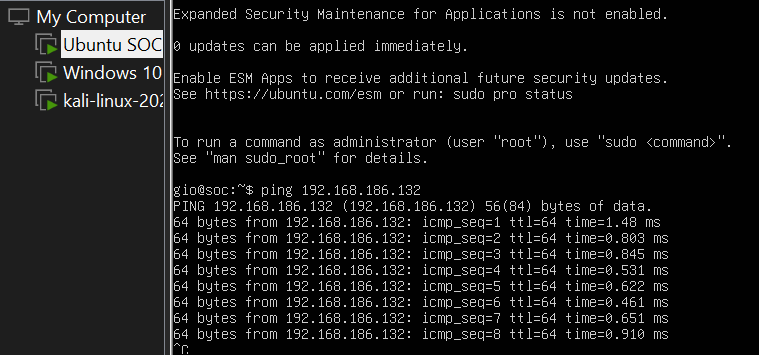

### 1.2 System Resilience: Creating Snapshots
Before installing software or conducting attacks, snapshots were taken of all virtual machines. This creates a safe restore point in case of system crashes, misconfigurations, or destructive testing.

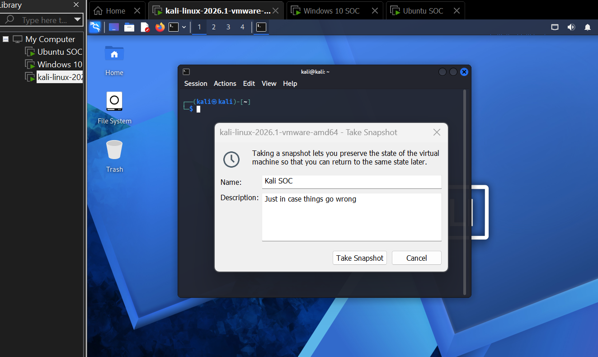

---

## Phase 2: SIEM Deployment (Wazuh)

### 2.1 Wazuh Installation
The monitoring core relies on Wazuh. This step documents the installation process of the Wazuh indexer, server, and dashboard onto an Ubuntu Linux instance.

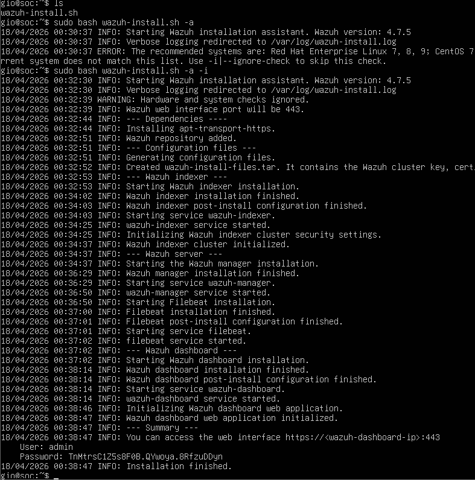

### 2.2 Initial SIEM Access
Following a successful deployment, the Wazuh web user interface was accessed for the first time using secure administrative credentials to verify system health.

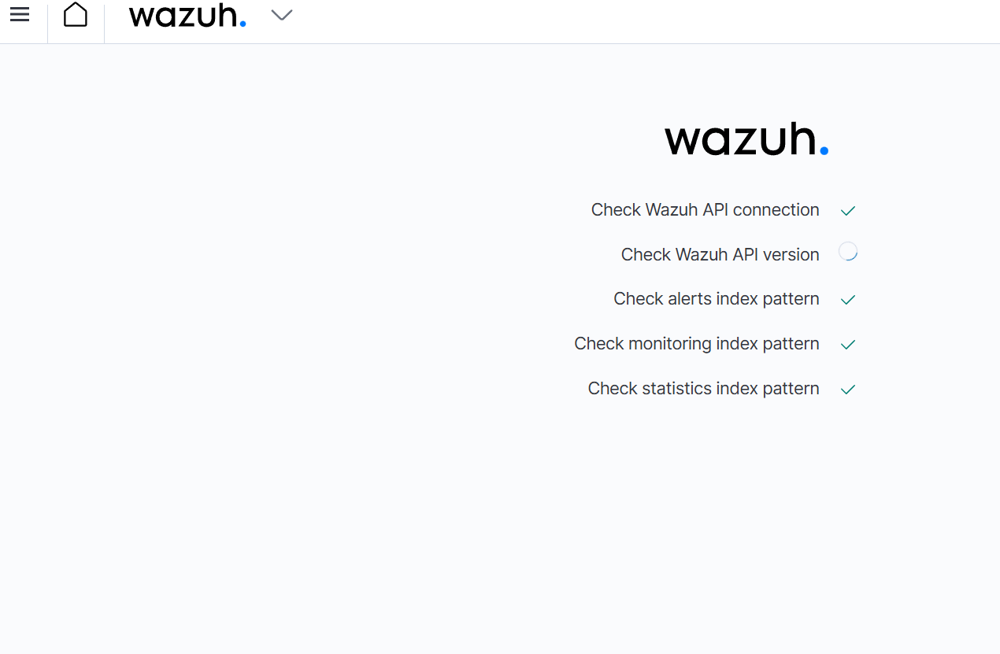

---

## Phase 3: Baseline Testing & Initial Telemetry

### 3.1 Initial Attack Vector: SMB Reconnaissance
Using the Kali Linux attacker machine, an initial connection attempt was made against the target Windows machine using `smbclient` to test for exposed network shares and communication baselines.

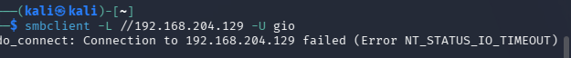

### 3.2 Verifying Telemetry Intake
Back in the Wazuh dashboard, the ingestion pipeline was verified by successfully locating the specific security log generated by the `smbclient` connection attempt.

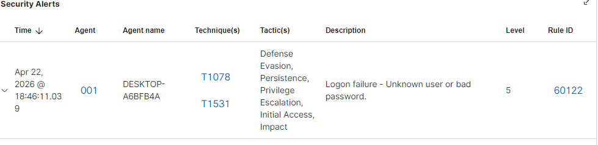

### 3.3 Deep Log Analysis: Windows Event ID 4625
To look closer at authentication failures, a specific query was run in the SIEM filtering for **Windows Event ID 4625** (An account failed to log on), isolating failed authentication data.

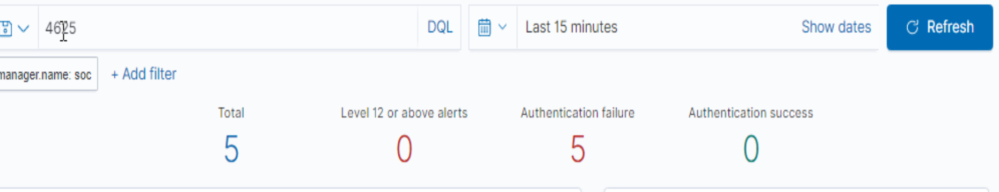

---

## Phase 4: Active Threat Simulation (Brute-Force Attack)

### 4.1 Launching the Brute-Force Attack
With baselines established, an active, automated network brute-force attack was launched from the Kali Linux machine targeting Windows authentication services to simulate a real-world credential-stuffing threat.

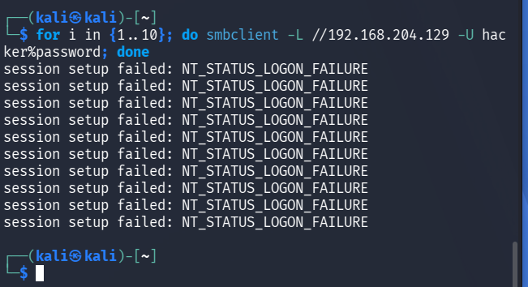

### 4.2 SIEM Alert Detection
Wazuh successfully triggered a high-severity alert, accurately catching the high volume of failed logon attempts indicative of a brute-force attack.

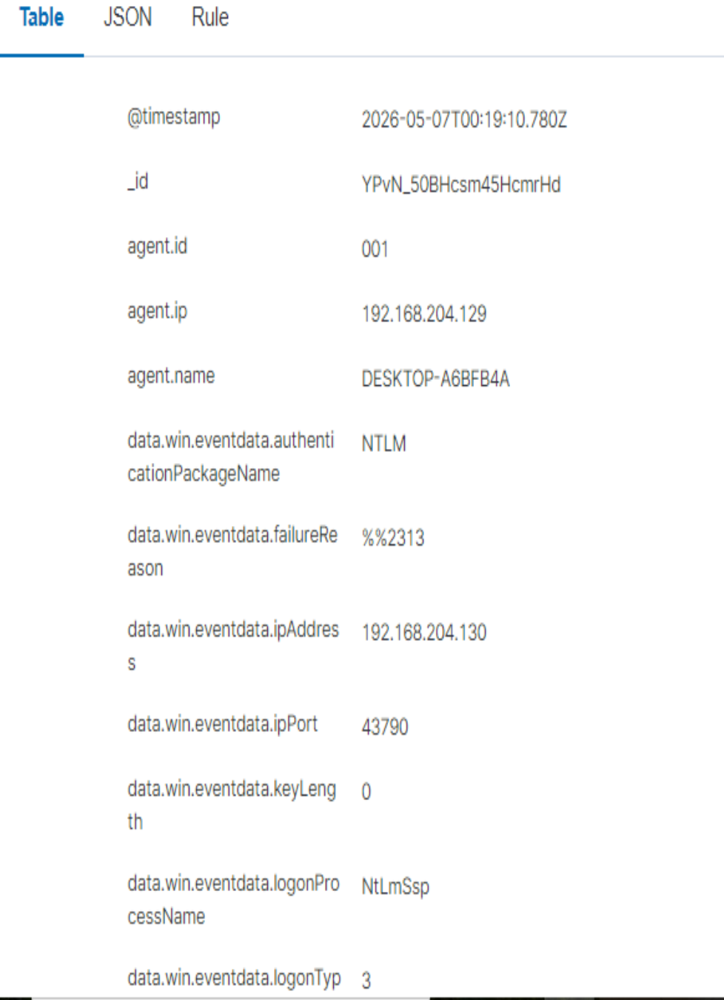

### 4.3 Log Granularity & Analysis
A deep dive into the metadata of the brute-force alert shows granular details collected by the Wazuh agent, including target usernames, timestamp density, and the attacker's source IP.

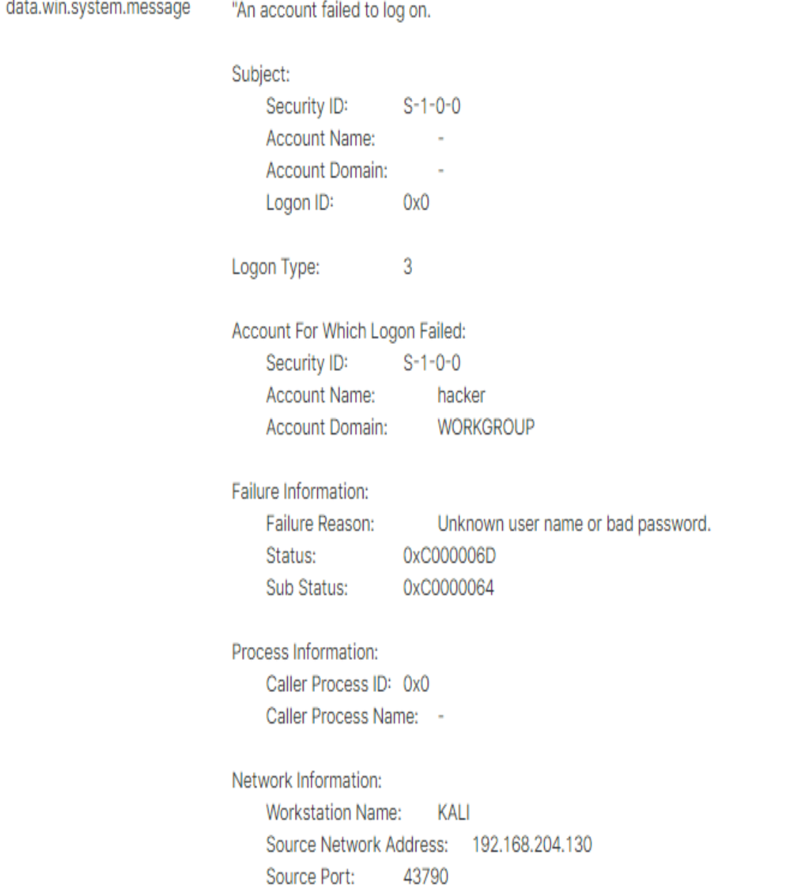

### 4.4 Dashboard Visualization
The security events were mapped to the main Wazuh Security Events dashboard, demonstrating how a SOC analyst would visually identify the spike in authentication anomalies.

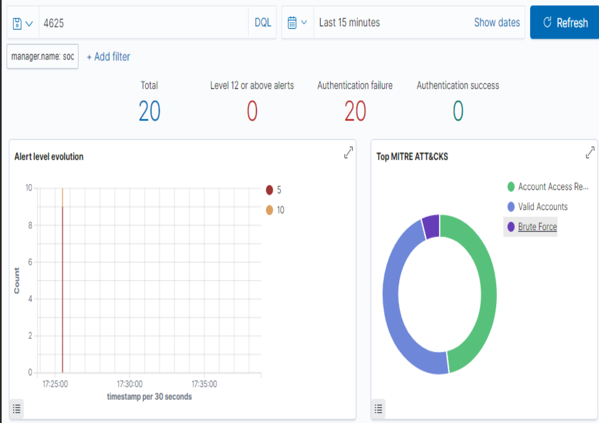

---

## Phase 5: Network Intrusion Detection (Nmap & Suricata)

### 5.1 Nmap Scan Detection via Suricata
An Nmap network scan initiated by the Kali Linux machine was successfully intercepted and flagged on the Ubuntu machine utilizing **Suricata** as a Network Intrusion Detection System (NIDS).

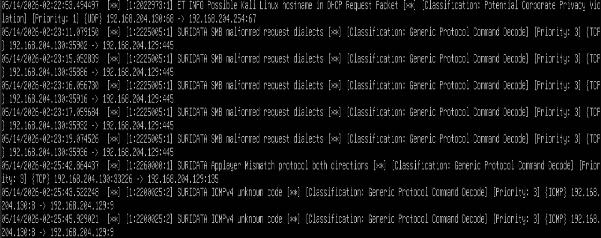

---

## Phase 6: Advanced Host Telemetry & Windows Auditing

### 6.1 Monitoring PowerShell Activity
Host-level monitoring was validated as Wazuh successfully intercepted and alerted on standard PowerShell execution on the target Windows endpoint.

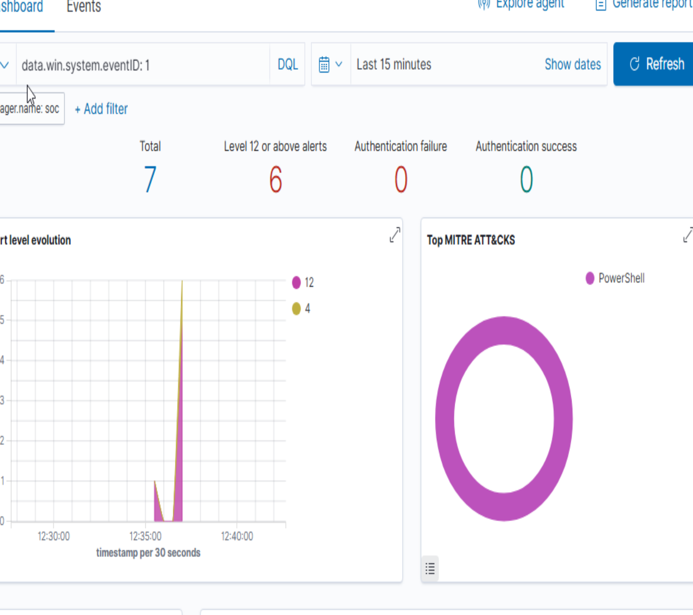

### 6.2 Detecting Obfuscation: Encoded PowerShell
To simulate defense evasion, an encoded PowerShell command was executed. Wazuh effectively logged the activity, capturing the base64/encoded payload for forensic review.

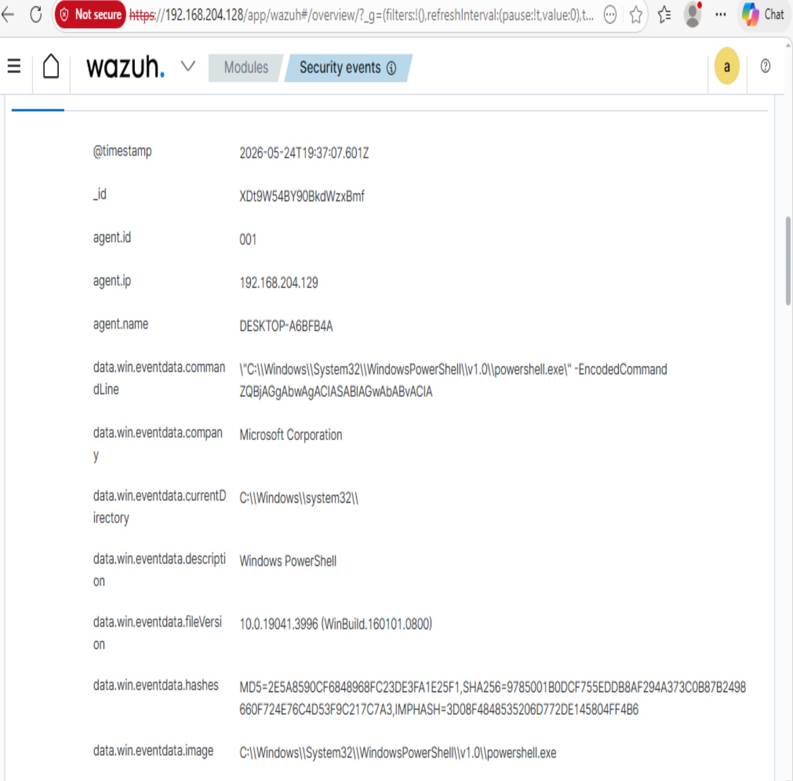

### 6.3 Windows Account Modification
Security auditing configurations were put to the test by modifying a local Windows user account. Wazuh successfully caught the local user account change event.

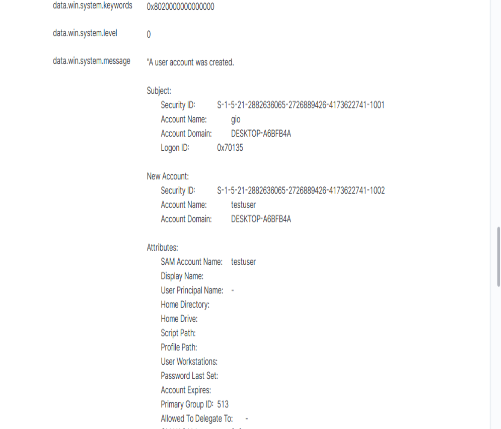

### 6.4 System Audit Policy Changes
Finally, changes made to the system's auditing configuration commands were successfully logged, ensuring that any attempts by an adversary to alter logging policies to hide their tracks would be caught.

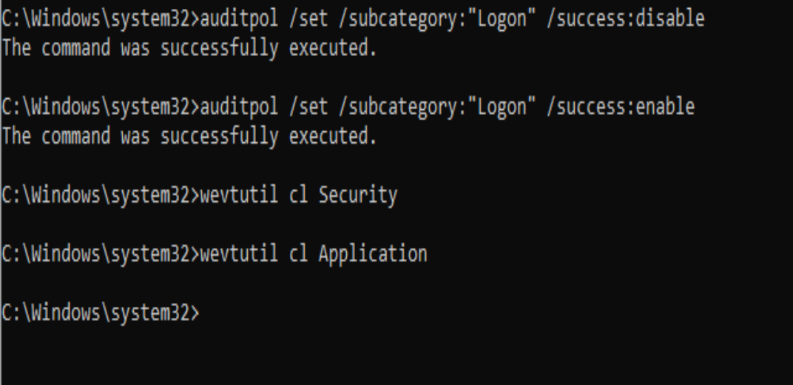

I couldn't find anything in Wazuh for the screenshot above. I could only find the changes in Event Viewer.
